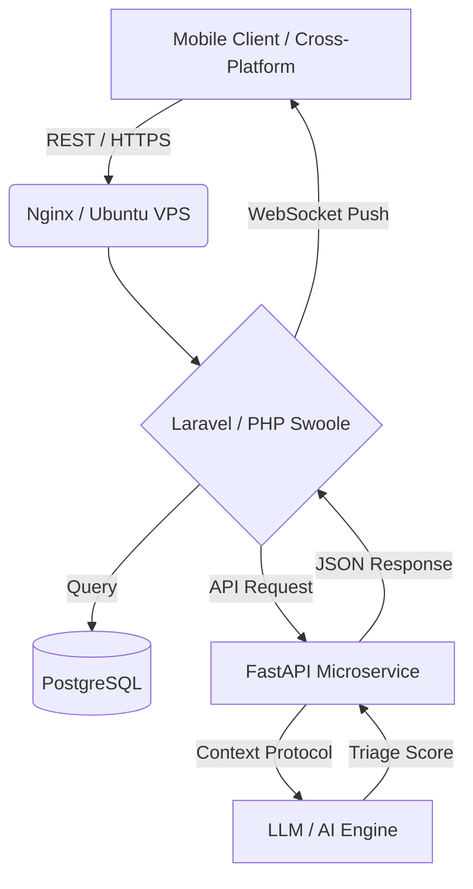

# Hi 👋, I'm Ashar Ayub 

### Lead Software Engineer & AI-Augmented Software Architect

- 🔭 Currently working with: Modern PHP (Laravel Octane/Swoole), AI-Augmented workflows (Cursor IDE, MCP), Python ETL pipelines, and AWS Cloud Infrastructure.
- 💬 Ask me about: High-throughput System Architecture, LLM Integrations (FastAPI/Vector DBs), Disaster Recovery, and Cross-Platform Mobile Ecosystems.
- 📫 LinkedIn: [linkedin.com/in/ashar-ayub-9604611a6](https://www.linkedin.com/in/ashar-ayub-9604611a6/)
- 📧 Email: asharproject24@gmail.com
- ⚡ Fun fact: PHP used to mean "Personal Home Page". Today it's a recursive acronym: "PHP: Hypertext Preprocessor".

---

### 🛠️ Tech Stack

**Backend & Real-Time**  

**AI & Agentic Engineering**  

**Cloud & Infrastructure**  

**Frontend & Cross-Platform**  

---

### 📌 Architectural Highlights
- **AI-Driven Clinical Systems:** Architected FastAPI microservices embedding LLMs directly into medical workflow applications for sub-second triage.
- **Real-Time Telemetry & Media Streaming:** Deployed custom WebSocket servers with Coturn (STUN/TURN) backbones for low-latency P2P edge streaming.

---

### ⏱️ Weekly Development Breakdown

<!--START_SECTION:waka-->
<!--END_SECTION:waka-->

---

### 🏗️ System Architecture Showcase: AI-Driven Clinical Triage

<!-- ### 📊 GitHub Metrics & Activity

  

 -->

<!--
**AsharKlabs/AsharKlabs** is a ✨ _special_ ✨ repository because its `README.md` (this file) appears on your GitHub profile.

Here are some ideas to get you started:

- 🔭 I’m currently working on ...
- 🌱 I’m currently learning ...
- 👯 I’m looking to collaborate on ...
- 🤔 I’m looking for help with ...
- 💬 Ask me about ...
- 📫 How to reach me: ...
- 😄 Pronouns: ...
- ⚡ Fun fact: ...
-->
